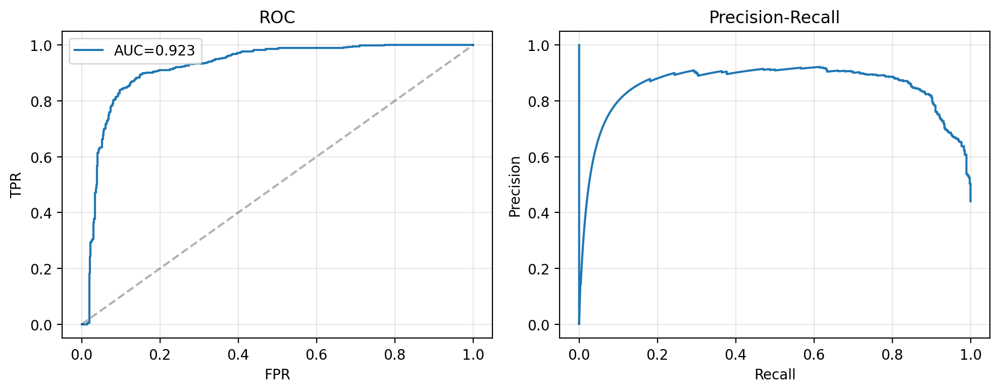
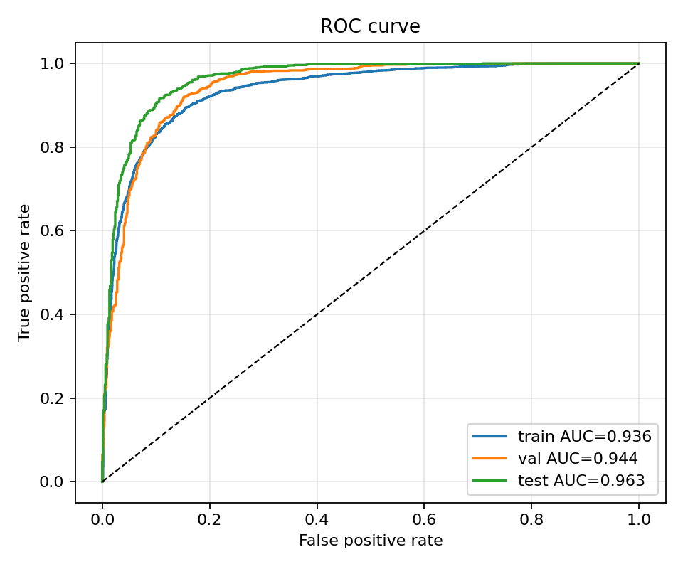
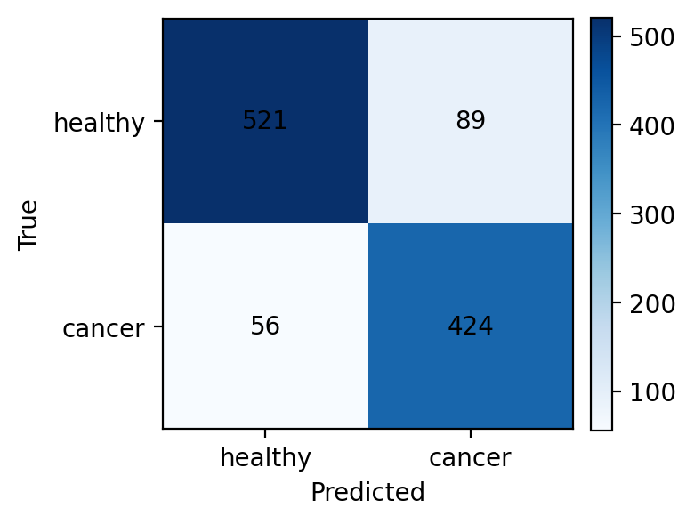
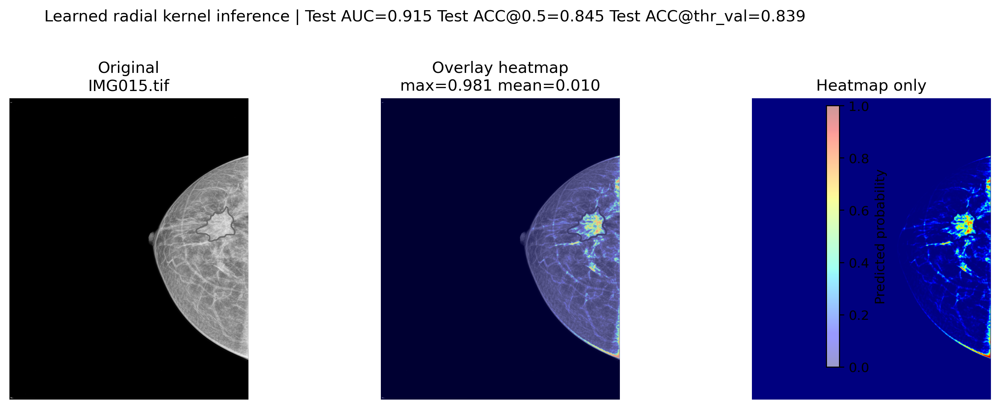
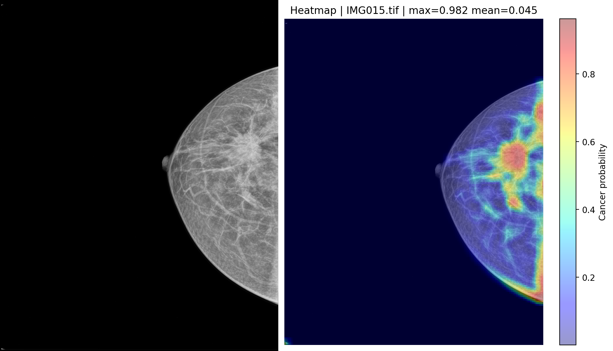
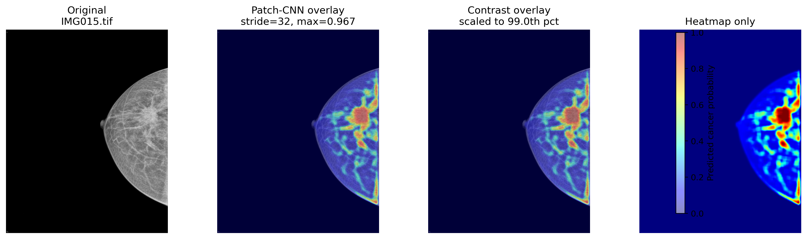

# Optimal Classification of Low-volume Medical Data with Adaptive Kernel Design

Masoud Vahid Dastgerdi  
Affiliation Placeholder  
email.placeholder@example.com

Oleg Stanislavovich Pianykh  
Affiliation Placeholder  
email.placeholder@example.com

## Abstract

Accurate cancer localization in medical images is often approached with high-capacity convolutional neural networks, but their opacity and data requirements can limit their utility in settings where interpretability and constrained supervision are important. We present an interpretable kernel-learning framework for patch-level cancer classification from pixel-level annotations, with primary emphasis on a learned single radial kernel. The method converts red-contour annotations into lesion masks, samples positive tumor patches and negative background patches with patient-level train/validation/test separation, and represents each patch using an explicit convolutional response. The focused radial model learns a circularly symmetric profile rather than a full unconstrained convolutional filter, yielding a compact and inspectable one-kernel classifier. We also evaluate larger analytic kernel banks spanning Gaussian, anisotropic Gaussian, difference-of-Gaussians, Laplacian-of-Gaussian, Gabor, HOG-inspired, GLCM-inspired, LBP-inspired, and MRF-inspired filters. On the repository dataset, comprising 10,070 extracted patches from malignant and normal TIFF images, the learned single radial kernel achieves 0.9286 test ROC-AUC and 0.8668 test accuracy. Larger selected kernel banks reach up to 0.9387 test ROC-AUC and 0.8866 test accuracy, while a fully learned patch CNN baseline achieves 0.9626 test ROC-AUC and 0.9021 test accuracy. These results show that a single interpretable radial kernel captures substantial discriminative signal while remaining far more transparent than a learned CNN.

## 1. Introduction

Medical image classification systems are increasingly used to support cancer diagnosis, lesion triage, and downstream localization. Deep convolutional models can achieve strong predictive performance, but they typically require substantial data and their learned internal representations are difficult to interpret directly. This tension is especially relevant for clinical workflows in which models should not only provide accurate decisions but also expose evidence that can be inspected by researchers or clinicians.

This work studies a complementary approach: instead of learning all visual primitives end-to-end, we construct a large bank of interpretable convolutional kernels and learn a classifier over their patch-level responses. The central hypothesis is that a diverse bank of biologically and radiologically meaningful texture, edge, blob, and local-contrast filters can capture discriminative differences between lesion and non-lesion tissue while preserving explicit filter semantics.

The repository implements an end-to-end patch-level cancer classification pipeline. Pixel-level red-contour annotations are converted to binary malignant masks; positive patches are sampled from lesion regions and negative patches are sampled from background regions. Each patch is convolved with kernels from multiple analytic families, and each kernel response is summarized by a scalar activation statistic. Candidate kernels are ranked using ROC-AUC and Fisher score, then selected with maximal marginal relevance (MMR) to reduce redundancy. A logistic or shallow multilayer perceptron classifier is trained on the selected kernel-response features.

The main contributions are:

- We formulate an interpretable learned radial-kernel framework for cancer patch classification, using a single circularly symmetric convolutional profile as the primary compact model.
- We implement a reproducible patient-level experimental pipeline with annotation-derived patch extraction, train/validation/test splits, feature caching, model checkpoints, ROC/PR curves, confusion matrices, and heatmap visualization.
- We empirically compare the learned single radial kernel with compact selected-kernel models, larger selected-kernel banks, abess-based sparse selection, composite kernels, triangular/square shape-sensitive kernels, and a fully learned patch CNN baseline.
- We incorporate report-level analyses of Sobol QMC kernel sampling, radial-kernel variants, and rotation-invariant kernel averaging.
- We show that a selected analytic kernel bank achieves strong performance (up to 0.9387 test ROC-AUC), approaching a CNN baseline while remaining substantially more interpretable.

## 2. Related Work

Classical medical image analysis has long used engineered features, including edges, blobs, texture descriptors, and co-occurrence statistics, to characterize tissue appearance [1,2]. Gaussian derivatives, Laplacian-of-Gaussian filters, and difference-of-Gaussians filters are standard tools for multiscale smoothing, edge detection, and blob detection [3]. Gabor filters represent oriented frequency-selective texture patterns and have been widely used in biomedical imaging [4]. Histogram-of-oriented-gradients descriptors capture local edge-orientation distributions [5], while local binary patterns and gray-level co-occurrence matrices model local texture and spatial intensity relationships [6,7].

Several cancer-classification studies have shown that handcrafted texture representations can remain useful when training sets are small. Doyle et al. used Gabor and architectural descriptors with an SVM for breast histopathology grading [13]. Ojansivu et al. combined LBP/LPQ texture descriptors with kernel SVMs for breast cancer morphology classification [14]. Gopinath and Shanthi reported a small-data thyroid cytology pipeline based on Gabor statistical features and SVM classification [15]. Related breast and cervical cancer studies have also used Gabor, co-occurrence, morphological, or other handcrafted descriptors with classical classifiers [16-18]. These works motivate the present focus on explicit filter responses, but they generally rely on fixed descriptor families rather than systematic generation, ranking, and diversity-aware selection of a broad analytic kernel bank.

Deep convolutional neural networks learn such filters automatically and have become dominant in medical image classification [8,9]. However, end-to-end learning often trades interpretability for performance, and learned filters may be difficult to map to known visual structures. Hybrid approaches that combine fixed or constrained feature banks with learned classifiers provide an intermediate point in this design space: the low-level representation remains inspectable, while the classifier can still learn task-specific decision boundaries. Recent examples include fusing deep features with texture descriptors for renal cancer detection [19] and feed-forward breast histopathology models that use logistic-regression or SVM modules rather than standard back-propagation through a large CNN [20].

Feature selection is another relevant line of work. Sparse model selection and L0-regularized methods aim to identify compact predictive subsets [10]. Maximal marginal relevance, originally introduced for information retrieval, selects items by balancing relevance and diversity [11]. In the present setting, relevance corresponds to cancer-versus-background discriminative strength, while diversity corresponds to low redundancy among kernel response vectors.

## 3. Methodology

### 3.1 Problem Formulation

Let an image patch be denoted by \(x \in \mathbb{R}^{H \times W}\), with binary label \(y \in \{0,1\}\), where \(y=1\) indicates a patch sampled from a malignant annotation mask and \(y=0\) indicates background or normal tissue. Given a training set \(\mathcal{D}=\{(x_i,y_i)\}_{i=1}^{N}\), the goal is to learn a classifier \(f(x)\) that estimates \(p(y=1 \mid x)\).

Instead of feeding raw pixels directly into a deep model, we define a bank of analytic kernels

\[
\mathcal{K} = \{k_j\}_{j=1}^{M}, \quad k_j \in \mathbb{R}^{s \times s},
\]

and map each patch to a response vector

\[
\phi(x) = [r_1(x), r_2(x), \ldots, r_K(x)] \in \mathbb{R}^{K},
\]

where \(K \le M\) is the number of selected kernels. The default response statistic is the maximum absolute convolutional activation:

\[
r_j(x)=\max_{u,v}|(x * k_j)_{u,v}|.
\]

The repository also supports signed maximum and mean absolute response functions.

### 3.2 Patch Extraction from Annotations

Annotation images contain red malignant contours. The implementation thresholds the red channel while suppressing green and blue channels, applies morphological dilation, erosion, closing, and hole filling, and obtains a binary lesion mask. Positive patches are sampled from regions whose mask coverage exceeds a configured threshold. Negative patches are sampled outside the lesion, with support for near-lesion and far-lesion sampling. In the main experiments, the patch size is 128 x 128 pixels, positives require at least 0.8 lesion-mask coverage, negatives allow at most 0.02 lesion-mask coverage, and patches with low nonzero intensity fraction are filtered.

Patient or study identifiers are inferred from filenames, and splits are assigned at the image/patient level using a 70/15/15 train/validation/test ratio. This prevents patches from the same source image from appearing simultaneously in training and held-out evaluation splits.

### 3.3 Kernel Families

The main kernel bank contains nine analytic families:

- Gaussian filters for local smoothing and intensity aggregation.
- Anisotropic Gaussian filters for elongated and oriented structures.
- Difference-of-Gaussians filters for multiscale contrast.
- Laplacian-of-Gaussian filters for blob-like structures.
- Gabor filters for oriented texture and frequency patterns.
- HOG-inspired derivative filters for local gradient orientation.
- GLCM-inspired two-point offset filters for spatial co-occurrence.
- LBP-inspired center-neighbor contrast filters.
- MRF-inspired discrete Laplacian filters for local smoothness.

Each family is sampled over a family-specific parameter space. The implementation supports random sampling, Sobol quasi-Monte Carlo sampling, and Latin hypercube sampling. Unless otherwise noted, experiments use kernels of size 31 x 31.

### 3.4 Learned Single Radial Kernel

The primary compact model in this paper constrains the convolutional filter to be circularly symmetric and learns a radial profile \(f(r)\). Instead of learning an unconstrained \(s \times s\) kernel, every pixel at the same distance from the kernel center shares a parameter. This reduces the number of degrees of freedom, makes the learned structure easier to inspect, and enforces an isotropic inductive bias that is appropriate for local blob-like and halo-like tissue patterns. The main radial variant uses an absolute-maximum response and learns a free radial profile. Additional signed compact variants use a signed response, hard radial cutoff, monotonicity/decay regularization, and scale normalization to improve interpretability at some cost in AUC.

### 3.5 Kernel Ranking and Selection

For each candidate kernel, the method computes response distributions for positive and negative patches. Two univariate scores are used:

\[
\mathrm{AUC}(k_j) = \mathrm{ROC\text{-}AUC}(\{r_j(x_i)\}, \{y_i\}),
\]

and the Fisher score

\[
F(k_j)=\frac{(\mu_j^+ - \mu_j^-)^2}{(\sigma_j^+)^2 + (\sigma_j^-)^2 + \epsilon}.
\]

The top \(M'\) candidates are ranked by AUC and Fisher score. MMR then selects a subset iteratively:

\[
k^*=\arg\max_{k_j \notin S}
\lambda \mathrm{AUC}(k_j) - (1-\lambda)\max_{k_\ell \in S}
|\rho(r_j,r_\ell)|,
\]

where \(S\) is the selected set, \(\rho\) is Pearson correlation between response vectors, and \(\lambda=0.75\) in the main experiments.

### 3.6 Classifier

The selected response vector \(\phi(x)\) is passed to either a logistic classifier or a shallow MLP. The primary reported kernel-bank experiments use a logistic classifier trained with binary cross-entropy using Adam. Feature standardization is enabled in several later experiments. The CNN baseline uses a four-block convolutional network with batch normalization, ReLU, max pooling, dropout, adaptive average pooling, and a two-layer linear head trained with cross-entropy and AdamW.

### 3.7 Algorithm

```text
Algorithm 1: Interpretable radial and kernel-bank cancer patch classification
Input: images, red-contour annotations, kernel families F, selected size K
Output: trained classifier f, selected kernels S

1. Convert annotation contours into binary lesion masks.
2. Sample positive patches from lesion regions and negative patches from background/normal tissue.
3. Split images at patient/study level into train, validation, and test sets.
4. Generate analytic kernel bank from families F.
5. For every kernel, compute scalar responses on all training patches.
6. Rank kernels by ROC-AUC and Fisher score.
7. Select kernels with MMR to balance discrimination and response diversity.
8. Train a logistic or shallow neural classifier on selected responses.
9. Evaluate ROC-AUC, accuracy, precision, recall, F1, and confusion matrices on held-out splits.
```

## 4. Experimental Setup

### 4.1 Dataset

The repository contains TIFF images under `data/TIFF Images/`, with 127 malignant images, 365 normal images, and 125 malignant annotation files available locally. The extracted patch dataset under `data/patches/` contains 10,070 patches:

| Split | Positive patches | Negative patches | Total |
|---|---:|---:|---:|
| Train | 2,900 | 3,430 | 6,330 |
| Validation | 1,080 | 790 | 1,870 |
| Test | 1,040 | 830 | 1,870 |
| Total | 5,020 | 5,050 | 10,070 |

The slight split imbalance follows from patient-level assignment and patch extraction success rates. In the kernel-bank experiments, patches are loaded in grayscale and resized according to the experiment configuration, typically 128 x 128 pixels.

### 4.2 Evaluation Metrics

The primary metric is ROC-AUC because it is threshold-independent and robust to moderate class imbalance. Accuracy is reported for all kernel-bank experiments. For the CNN baseline, precision, recall, F1, ROC-AUC, accuracy, loss, and confusion matrices are available.

### 4.3 Baselines and Variants

We evaluate the following model families from the repository outputs:

- **MMR kernel bank:** analytic kernels ranked by AUC/Fisher and selected using MMR.
- **abess sparse selection:** optional L0-style sparse feature selection using the abess package.
- **Composite kernels:** groups of selected kernels combined into one or more normalized weighted-sum kernels.
- **Shape-sensitive kernels:** triangular and square kernel families evaluated in separate experiments.
- **Patch CNN:** a learned convolutional baseline trained directly from RGB patches.

### 4.4 Implementation Details

The principal MMR configurations use nine kernel families, 31 x 31 kernels, an absolute-maximum response statistic, 60 training epochs, batch size 64, learning rate \(5 \times 10^{-4}\), and patient-level train/validation/test evaluation. The MMR parameter is \(\lambda=0.75\). The strongest reported interpretable configurations use larger selected banks, such as 90 selected kernels from a broader candidate pool. Compact models with \(K=1\), \(K=3\), and \(K=5\) are also included.

The CNN baseline uses 128 x 128 RGB inputs, batch size 64, AdamW with learning rate \(3 \times 10^{-4}\), weight decay \(10^{-4}\), patience 6, and a maximum of 25 epochs. The recorded best model occurs by epoch 6 based on validation ROC-AUC.

The March and April reports include additional single-radial-kernel experiments. These are treated as separate ablations because they optimize kernel parameters directly rather than selecting from the fixed multikernel bank.

## 5. Results

### 5.1 Main Quantitative Results

Table 1 summarizes representative held-out results. The table is organized around the learned single radial kernel, which is the central model of this paper, followed by the CNN reference and the remaining interpretable baselines sorted by test ROC-AUC. The radial model uses only one learned kernel response yet reaches 0.9286 test ROC-AUC and 0.8668 test accuracy. The strongest larger selected kernel bank reaches 0.9387 test ROC-AUC and 0.8866 test accuracy, while the CNN baseline remains the strongest absolute performer with 0.9626 test ROC-AUC and 0.9021 test accuracy.

**Table 1. Held-out performance of representative models. The primary model of interest is bolded; the strongest reference and selected-bank results are also emphasized.**

| Model / configuration | Selection | Selected features | Validation AUC | Validation Acc. | Test AUC | Test Acc. |
|---|---:|---:|---:|---:|---:|---:|
| **Learned single radial kernel (primary focus)** | **direct radial fit** | **1** | **0.9189** | **0.8545** | **0.9286** | **0.8668** |
| Patch CNN reference | learned CNN | learned | **0.9445** | **0.8818** | **0.9626** | **0.9021** |
| Selected kernel bank with QMC sampling | MMR | 90 | 0.9270 | 0.8603 | **0.9387** | **0.8866** |
| Selected kernel bank, variant A | MMR | 90 | 0.9271 | 0.8636 | 0.9377 | 0.8882 |
| Selected kernel bank, variant B | MMR | 90 | 0.9273 | 0.8620 | 0.9376 | 0.8888 |
| Larger selected kernel bank | MMR | 200 | 0.9159 | 0.8514 | 0.9313 | 0.8578 |
| Sparse ABESS-selected bank | ABESS | 200 | 0.9095 | 0.7849 | 0.9236 | 0.7690 |
| Shape-sensitive triangular/square bank | MMR | 24 | 0.9109 | 0.8481 | 0.9221 | 0.8465 |

These results support three observations. First, the learned radial kernel is a strong one-feature classifier, outperforming several larger sparse or shape-sensitive alternatives despite using only a single interpretable response. Second, learned CNN features provide the best absolute accuracy and AUC in the available experiments. Third, the gap between the radial model, larger selected kernel banks, and the CNN is modest in ROC-AUC, suggesting that explicit radial texture and morphology cues capture a substantial fraction of the discriminative signal.

### 5.2 Compact Kernel Ablations

The selected-kernel model and CNN baseline curves are shown below.





Table 2 reports compact MMR models. Even a single selected kernel reaches 0.9157 test ROC-AUC, and the best three-kernel configuration reaches 0.9239 test ROC-AUC. This is notable because the classifier operates on only one to three scalar responses per patch.

**Table 2. Compact-kernel MMR ablations.**

| Compact configuration | Selected kernels | Validation AUC | Validation Acc. | Test AUC | Test Acc. |
|---|---:|---:|---:|---:|---:|
| Single-kernel selected model | 1 | 0.8994 | 0.8307 | 0.9157 | 0.8449 |
| Single-kernel model from a larger candidate shortlist | 1 | 0.9010 | 0.8330 | 0.9179 | 0.8428 |
| Three-kernel selected model with stronger validation accuracy | 3 | 0.9085 | 0.8497 | 0.9101 | 0.8417 |
| Three-kernel selected model with stronger test AUC | 3 | 0.9085 | 0.8011 | 0.9239 | 0.7914 |
| Five-kernel selected model | 5 | 0.9071 | 0.7765 | 0.9234 | 0.7594 |

The compact runs show that individual kernels can be strongly discriminative, but thresholded accuracy varies substantially. This indicates that the raw ranking objective is aligned with AUC but not necessarily with calibration or the default 0.5 decision threshold.

The learned radial-kernel reports reinforce this point. A directly optimized unconstrained radial kernel reaches 0.9286 test AUC and 0.8668 test accuracy, outperforming several compact selected-kernel variants. A more constrained signed compact radial kernel improves interpretability by enforcing signed response, limited support, and smoother radial decay, but its reported test AUC drops to 0.8808. An independently initialized smooth signed radial model reports 0.9187 test AUC and 0.848 test accuracy. These results suggest a performance-interpretability tradeoff inside the single-kernel design space.

### 5.3 Sampling Strategy: Random versus QMC

The QMC report compares a random-sampling baseline against Sobol low-discrepancy sampling under matched high-capacity MMR/composite settings: 4,500 total kernels, \(K=90\) selected base kernels, and eight composite kernels. QMC improves all reported test metrics in that comparison.

**Table 3. Random versus Sobol QMC kernel sampling.**

| Evaluation | Random sampling | QMC sampling | Absolute gain |
|---|---:|---:|---:|
| Base model test AUC | 0.9195 | 0.9387 | +0.0192 |
| Base model test accuracy | 0.8646 | 0.8866 | +0.0221 |
| Composite test AUC | 0.8855 | 0.8934 | +0.0080 |
| Composite test accuracy | 0.8063 | 0.8176 | +0.0114 |

This supports Sobol sampling as a useful design choice for covering heterogeneous kernel-parameter spaces more evenly than independent random sampling.

### 5.4 Composite Kernel Analysis

Composite kernels are constructed by grouping selected kernels and summing them with normalization. In the available experiments, composite models are consistently weaker than their non-composite counterparts. For example, one 90-kernel selected-bank model obtains 0.9376 test AUC, whereas its eight-composite representation obtains 0.9026 test AUC. The strongest 90-kernel selected bank obtains 0.9387 test AUC before composition and 0.8934 after composition.

**Table 4. Composite kernel results.**

| Configuration | Base selected kernels | Composites | Base test AUC | Base test Acc. | Composite test AUC | Composite test Acc. |
|---|---:|---:|---:|---:|---:|---:|
| Selected-bank variant B | 90 | 8 | 0.9376 | 0.8888 | 0.9026 | 0.8299 |
| QMC selected-bank model | 90 | 8 | 0.9387 | 0.8866 | 0.8934 | 0.8176 |
| Single-composite compression model | 90 | 1 | 0.9377 | 0.8882 | 0.8635 | 0.7797 |

This suggests that naive weighted summation destroys useful complementary response information. Composite filters may still be useful for visualization or deployment simplicity, but the current uniform grouping strategy is not a substitute for retaining multiple selected response channels.

### 5.5 Rotation-Invariant Kernels

The rotation-invariance reports construct circularly symmetric kernels by averaging rotated versions of a composite kernel. On a newly generated patch split, a right-angle averaged invariant kernel obtains 0.8755 test AUC and 0.8006 test accuracy, compared with 0.8933 AUC and 0.8150 accuracy for the original non-invariant composite kernel. The invariant kernel gives identical metrics under 0, 90, 180, and 270 degree rotations, confirming exact right-angle stability. Averaging over every 10 degrees produces slightly lower performance in the reported run. Thus, rotation averaging offers predictable invariance but introduces a measurable performance cost.

### 5.6 Comparison with abess Selection

ABESS-based sparse selection provides competitive AUC but lower thresholded accuracy in several held-out runs. For example, the 200-feature ABESS-selected model reaches 0.9236 test ROC-AUC, but its test accuracy is 0.7690. Compact ABESS models with three to five selected features reach approximately 0.9216 to 0.9225 test AUC but lower accuracy. These results suggest that sparse selection finds informative features, but the downstream model may require calibration, regularization adjustment, or threshold tuning to improve operating-point performance.

### 5.7 Qualitative Outputs

The repository includes ROC/PR curves, confusion matrices, kernel visualizations, scatter plots, and heatmaps for multiple held-out examples. These qualitative outputs are useful for inspecting whether high-response regions align with lesion-like regions. The current repository does not include expert qualitative scoring of heatmap localization, so we treat these visualizations as diagnostic rather than as formal localization metrics.









## 6. Discussion

The empirical results show that a learned single radial kernel can provide strong patch-level cancer discrimination. Its performance is below the best multi-kernel bank and CNN baseline, but it uses only one explicit convolutional profile and therefore offers a much simpler object for inspection. This is useful in research settings where model behavior should be audited beyond aggregate performance.

The compact-kernel experiments are especially informative. A one-kernel model achieving greater than 0.91 test AUC implies that certain simple local structures are strongly associated with annotated tumor patches in the current dataset. However, the lower and more variable accuracy of compact models shows that AUC alone is insufficient for deployment. Larger selected banks improve accuracy and provide more stable operating points.

The composite-kernel experiments reveal a limitation of simple feature compression. Summing selected filters into composite kernels reduces dimensionality but loses the identity of individual response channels. Since different filters may activate on distinct lesion characteristics, collapsing them before classification can remove discriminative structure that a classifier would otherwise combine nonlinearly or with separate weights.

The CNN baseline achieves the best performance. This is expected because it learns hierarchical features directly from RGB image patches and can adapt all convolutional filters jointly. However, the CNN is less transparent: its internal filters and high-level activations are harder to interpret than the analytic kernel families. The proposed kernel-bank model therefore occupies a practical middle ground between classical handcrafted features and fully learned deep representations.

### Limitations

Several limitations should be noted. First, the experiments are patch-level rather than patient-level diagnostic evaluations. Patch classification performance does not directly imply whole-image or patient-level clinical utility. Second, the dataset appears to be local to the repository; external validation on independent cohorts is not provided. Third, patch labels are derived from annotation-mask coverage and may include boundary ambiguity. Fourth, the results are based on available experiment artifacts rather than a single locked benchmark script with repeated seeds and confidence intervals. Fifth, qualitative heatmap outputs are not accompanied by quantitative localization metrics such as Dice, IoU, or free-response ROC.

### Failure Cases

Likely failure modes include tumor patches with weak texture contrast, negative patches near lesion boundaries, normal tissue with tumor-like local texture, and images with annotation or staining variability. Compact models may also fail when a single discriminative texture cue is absent, motivating larger selected banks or hybrid models.

## 7. Conclusion

We presented an interpretable learned radial-kernel framework for patch-level cancer classification from annotated medical images. The method extracts annotation-derived patches, learns a compact circularly symmetric convolutional profile, and classifies patches using an explicit response from this single kernel. Across available repository experiments, the learned single radial kernel achieves 0.9286 test ROC-AUC and 0.8668 test accuracy. Larger selected kernel banks improve performance to 0.9387 test ROC-AUC and 0.8866 test accuracy, while a learned patch CNN reaches 0.9626 test ROC-AUC and 0.9021 test accuracy. These results indicate that a single interpretable radial filter retains substantial predictive power and provides a meaningful alternative or complement to black-box CNNs.

Future work should evaluate the method on external datasets, add repeated-seed confidence intervals, optimize calibration and thresholds, quantify heatmap localization, explore learned weighting for composite kernels, and combine analytic kernel banks with shallow learned adapters or attention mechanisms.

## References

[1] R. M. Haralick, K. Shanmugam, and I. Dinstein. Textural features for image classification. *IEEE Transactions on Systems, Man, and Cybernetics*, 1973.

[2] M. Kass, A. Witkin, and D. Terzopoulos. Snakes: Active contour models. *International Journal of Computer Vision*, 1988.

[3] D. G. Lowe. Distinctive image features from scale-invariant keypoints. *International Journal of Computer Vision*, 2004.

[4] J. G. Daugman. Uncertainty relation for resolution in space, spatial frequency, and orientation optimized by two-dimensional visual cortical filters. *Journal of the Optical Society of America A*, 1985.

[5] N. Dalal and B. Triggs. Histograms of oriented gradients for human detection. *CVPR*, 2005.

[6] T. Ojala, M. Pietikainen, and T. Maenpaa. Multiresolution gray-scale and rotation invariant texture classification with local binary patterns. *IEEE Transactions on Pattern Analysis and Machine Intelligence*, 2002.

[7] R. M. Haralick. Statistical and structural approaches to texture. *Proceedings of the IEEE*, 1979.

[8] A. Krizhevsky, I. Sutskever, and G. E. Hinton. ImageNet classification with deep convolutional neural networks. *NeurIPS*, 2012.

[9] G. Litjens et al. A survey on deep learning in medical image analysis. *Medical Image Analysis*, 2017.

[10] J. Zhu, B. Wen, J. Zhu, X. Zhang, and C. Wang. A polynomial algorithm for best-subset selection problem. *Proceedings of the National Academy of Sciences*, 2020.

[11] J. Carbonell and J. Goldstein. The use of MMR, diversity-based reranking for reordering documents and producing summaries. *SIGIR*, 1998.

[12] D. P. Kingma and J. Ba. Adam: A method for stochastic optimization. *ICLR*, 2015.

[13] S. Doyle, S. Agner, A. Madabhushi, M. Feldman, and J. Tomaszewski. Automated grading of breast cancer histopathology using spectral clustering with textural and architectural image features. *IEEE International Symposium on Biomedical Imaging*, 2008.

[14] V. Ojansivu, N. Linder, E. Rahtu, M. Pietikainen, M. Lundin, H. Joensuu, and J. Lundin. Automated classification of breast cancer morphology in histopathological images. *Diagnostic Pathology*, 8(Suppl. 1):S29, 2013.

[15] B. Gopinath and N. Shanthi. Support Vector Machine Based Diagnostic System for Thyroid Cancer using Statistical Texture Features. *Asian Pacific Journal of Cancer Prevention*, 14(1):97-102, 2013.

[16] Y. Zheng. Breast cancer detection with Gabor features from digital mammograms. *Algorithms*, 3(1):44-62, 2010.

[17] R. R. Kadhim and M. Y. Kamil. Breast invasive ductal carcinoma diagnosis using machine learning models and Gabor filter method of histology images. *International Journal of Reconfigurable and Embedded Systems*, 12(1):9-18, 2023.

[18] S. He, B. Xiao, H. Wei, S. Huang, and T. Chen. SVM classifier of cervical histopathology images based on texture and morphological features. *Technology and Health Care*, 31(1):69-80, 2023.

[19] J. Cai, M. Liu, Q. Zhang, Z. Shao, J. Zhou, Y. Guo, J. Liu, X. Wang, B. Zhang, and X. Li. Renal Cancer Detection: Fusing Deep and Texture Features from Histopathology Images. *BioMed Research International*, 2022:9821773, 2022.

[20] A. Karuppasamy, A. Abdesselam, R. Hedjam, H. Zidoum, and M. Al-Bahri. Feed-forward networks using logistic regression and support vector machine for whole-slide breast cancer histopathology image classification. *Intelligence-Based Medicine*, 9:100126, 2024.
